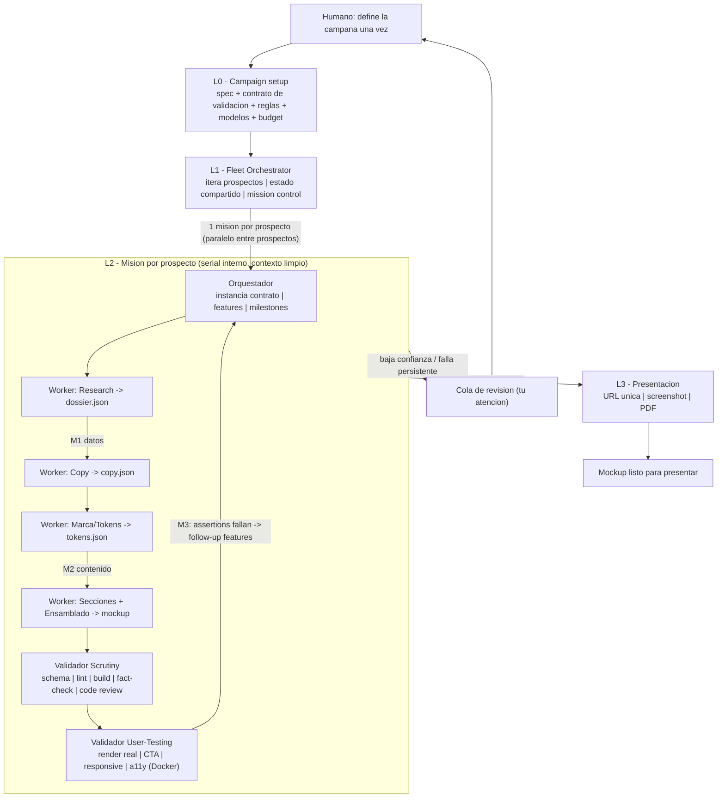

# Arquitectura Rev 2 — Flujo tipo "Missions" para landings de prospectos

> Rev 2 del esquema de bloques. Reescribe la Rev 1 (pipeline lineal) aplicando la metodología **Missions** (Factory / charla de Luke).
> Caso: generar mockups de landing personalizados para prospectos, modo **demo en frío**, empezando por estudios jurídicos.
> Fecha: 23/06/2026.

---

## 0. Idea rectora

El cuello de botella no es la inteligencia del modelo: es **tu atención**. Vos definís *qué* construir una sola vez (la campaña); el sistema resuelve el *cómo* por cada prospecto y solo te devuelve a la **cola de revisión** lo que falla o queda con baja confianza. Todo lo que pasa el contrato de validación sale directo a presentación sin tocarte.

Una landing por prospecto deja de ser "un pipeline" y pasa a ser una **misión**: un ecosistema de agentes que se comunican por *handoffs estructurados* y *estado compartido*, no una sola sesión de un agente.

---

## 1. Principios del video y cómo los aplico

La charla propone 5 frameworks multi-agente y Missions combina 4 (descarta *direct communication* por fragmentar el estado).

| Principio Missions | Aplicación a landings |
|---|---|
| **Delegation** | El orquestador spawnea workers (research, copy, marca, ensamblado) y sub-agentes de solo-lectura (scraping, búsqueda de referencias). |
| **Creator-Verifier** | Quien construye y quien valida son **agentes distintos con contexto fresco**. El validador nunca vio el código → encuentra errores que el constructor (con sesgo a que "funcione") no ve. |
| **Broadcast** | Estado de campaña compartido: reglas legales, "cero claims falsos", brand kit, presupuesto. Todos los agentes lo referencian para mantener coherencia. |
| **Negotiation** | En los límites de milestone: el orquestador decide si el handoff es válido, si hay que crear *follow-up features* o re-scopear. |
| **Validation contract antes de construir** | Se define *qué es una landing "lista y veraz"* en assertions ANTES de generar nada. Evita el anti-patrón "tests escritos después solo confirman lo que el código hizo". |
| **Contexto limpio por feature + commit** | Cada worker arranca sin baggage, produce su artefacto y lo "commitea"; el siguiente hereda un estado limpio y funcionando. |
| **Dos validadores adversariales** | *Scrutiny* (schema, lint, build, fact-check, code-review por sección) + *User-testing* (render real del mockup, CTA, responsive, a11y). |
| **Handoffs estructurados** | El worker no dice "listo": llena un handoff con qué hizo, qué quedó, comandos+exit codes, issues, assertions cubiertas. Self-heal en milestone boundaries. |
| **Serial + paralelización solo-lectura** | Dentro de una misión corre 1 worker/validador a la vez; se paralelizan solo operaciones de lectura. La tasa de error baja y la correctitud compone. |
| **Right model per role** ("droid whispering") | Planeamiento, implementación y validación usan modelos distintos; validación idealmente de otro proveedor para no compartir sesgo. |
| **Bitter lesson** | La orquestación vive en **prompts/skills**, no en una state machine rígida. Solo el bookkeeping (estado, gating, presupuesto) es determinístico. El sistema mejora con cada modelo nuevo. |

---

## 2. Dónde NO copio literal (adaptaciones propias)

1. **La "conversación de scoping" se eleva al nivel campaña, no por prospecto.** En modo demo en frío con 14+ prospectos no podés conversar cada misión. Vos aprobás *una vez* el spec, el contrato de validación y las reglas; cada misión los instancia automáticamente con los datos del prospecto.

2. **Paralelismo a nivel prospecto (seguro), serial dentro de la misión.** La charla corre features en serie porque tocan *el mismo* código. Acá cada prospecto tiene su propio output → **no hay recurso compartido entre prospectos**, así que las misiones de distintos prospectos pueden correr en paralelo sin conflicto. La regla serial aplica *dentro* de una misión (los workers tocan los mismos archivos del mockup).

3. **"Behavior validation" = render real del demo.** El user-testing validator encaja perfecto con tu requerimiento de Playwright / Chrome DevTools MCP en Docker: levanta el mockup, clickea el CTA, valida responsive y contraste. Es el tramo más largo en wall-clock (igual que en la charla).

4. **"Cero claims falsos" es una assertion legal de primera clase.** Para abogados, la veracidad no es un nice-to-have: es bloqueante. El contrato lo hace explícito.

---

## 3. Niveles de la arquitectura

```
L0 · CAMPAIGN SETUP (humano, una sola vez)
     spec de landing + contrato de validación + reglas/brand + asignación de modelos + presupuesto
        │
L1 · FLEET ORCHESTRATOR (por lote)
     itera prospectos · estado compartido (broadcast) · mission control · paralelo ENTRE prospectos
        │  (1 misión por prospecto)
L2 · MISIÓN POR PROSPECTO (serial interno, contexto limpio por feature)
     Orquestador → Workers → Validadores → (loop self-heal en milestones)
        │
L3 · ATENCIÓN HUMANA + SALIDA
     pasa contrato → Presentación (URL/screenshot/PDF)
     falla persistente / baja confianza → Cola de revisión (tu atención)
```

---

## 4. Los tres roles

### 4.1 Orquestador (planeamiento)
- Instancia el **contrato de validación** de la campaña con el dossier del prospecto.
- Decompone la landing en **features** (secciones) y **milestones**, y asigna a cada feature ≥1 assertion.
- Define las **skills/procedimientos** de cada worker para esta misión.
- En cada milestone evalúa handoffs y decide *follow-up features* o re-scope (negotiation).
- No escribe código. Modelo: razonamiento lento y cuidadoso.

### 4.2 Workers (implementación)
- Reciben **contexto limpio** + spec de su feature.
- Implementan y producen su artefacto (`dossier.json`, `copy.json`, `tokens.json`, secciones, `mockup`), luego "commitean".
- Llenan un **handoff estructurado** (ver §7).
- Dentro de una feature paralelizan solo lectura (scraping multi-fuente, búsqueda de referencias visuales).
- Modelo: fluidez de código rápida y creativa.

### 4.3 Validadores (verificación adversarial, contexto fresco)
Corren al final de cada milestone. **Nunca vieron el código.**

- **Scrutiny validator:** valida schema de artefactos, lint, build, **fact-check** (cada dato renderizado mapea a un campo `VERIFICADO` del dossier) y spawnea agentes de **code-review por sección** (paralelo, solo lectura).
- **User-testing validator:** levanta el mockup en navegador headless (**Playwright / Chrome DevTools MCP en Docker** — porque el Chrome MCP nativo de Windows a veces falla), interactúa: clickea el CTA de WhatsApp/tel, verifica que todas las secciones renderizan, responsive mobile/desktop, contraste AA, y toma screenshots. Es el tramo más lento.
- Modelo: seguimiento preciso de instrucciones; **idealmente otro proveedor** para no compartir sesgo de entrenamiento con los workers.

---

## 5. Features y milestones de una landing

**Features (workers, en serie):**
1. `research` → `dossier.json`
2. `copy` → `copy.json`
3. `marca_tokens` → `tokens.json`
4. `secciones_y_ensamblado` → `mockup/`

**Milestones (puntos de validación):**
- **M1 — Datos:** tras `research`. Valida apto/cola, desambiguación, clases de campo.
- **M2 — Contenido:** tras `copy` + `marca_tokens`. Valida veracidad legal, fallback de marca.
- **M3 — Producto:** tras `secciones_y_ensamblado`. Corren los dos validadores (scrutiny + user-testing). Es donde el contrato se cumple o se generan follow-ups.

> Como dice la charla: la validación **casi nunca pasa a la primera**. El loop de follow-up features no es un caso de error, es el funcionamiento normal.

---

## 6. Contrato de validación (el corazón del sistema)

Se escribe una vez por campaña, antes de generar nada. Define correctitud **independiente de la implementación**. Cada feature cubre ≥1 assertion; la unión de features cubre el 100% de las assertions bloqueantes.

```json
{
  "contract_id": "landing_legal_v2",
  "aplica_a": "estudios_juridicos",
  "regla_cobertura": "cada feature cubre >=1 assertion; la union de features cubre el 100% de assertions bloqueantes",
  "assertions": [
    {"id":"ID-01","categoria":"identidad","texto":"El hero muestra el nombre exacto del estudio (dossier.entidad.nombre)","feature":"hero","severidad":"bloqueante"},
    {"id":"ID-02","categoria":"identidad","texto":"La ciudad/zona mostrada coincide con dossier.ubicacion.ciudad","feature":"hero|contacto","severidad":"bloqueante"},
    {"id":"AC-01","categoria":"veracidad","texto":"Todo dato factico renderizado mapea a un campo dossier de clase VERIFICADO","feature":"*","severidad":"bloqueante"},
    {"id":"AC-02","categoria":"veracidad","texto":"No hay testimonios salvo resenas reales presentes en dossier.prueba_social","feature":"prueba_social","severidad":"bloqueante"},
    {"id":"LG-01","categoria":"legal","texto":"No hay claims de resultados garantizados ni superioridad comparativa","feature":"*","severidad":"bloqueante"},
    {"id":"BR-01","categoria":"marca","texto":"Sin logo real se usa monograma; nunca un logo inventado presentado como propio","feature":"hero","severidad":"bloqueante"},
    {"id":"CTA-01","categoria":"funcional","texto":"El boton WhatsApp abre wa.me con el numero real del dossier","feature":"hero|contacto","severidad":"bloqueante"},
    {"id":"UX-01","categoria":"render","texto":"La pagina renderiza sin errores de consola en mobile y desktop","feature":"*","severidad":"bloqueante"},
    {"id":"UX-02","categoria":"a11y","texto":"Contraste texto/fondo cumple WCAG AA","feature":"*","severidad":"alta"},
    {"id":"CP-01","categoria":"completitud","texto":"Las secciones opcionales aparecen solo si su dato existe; su ausencia degrada sin romper","feature":"*","severidad":"alta"},
    {"id":"PR-01","categoria":"presentable","texto":"El screenshot final luce pulido y coherente (revision UI/UX aprobada)","feature":"secciones_y_ensamblado","severidad":"alta"}
  ]
}
```

---

## 7. Handoff estructurado (anti-pérdida de contexto)

Cada worker/validador escribe esto al terminar. Es lo que permite self-heal en los milestones.

```json
{
  "mission_id": "koziarski_obera",
  "feature": "copy",
  "rol": "worker",
  "modelo": "<modelo-usado>",
  "status": "completado | parcial | bloqueado",
  "completado": ["hero", "areas_practica", "cta"],
  "pendiente": ["prueba_social: faltan resenas en dossier"],
  "comandos": [{"cmd": "npm run build", "exit": 0}],
  "issues_descubiertos": ["dossier.contacto.email vacio -> se omite seccion"],
  "assertions_cubiertas": ["ID-01", "AC-01", "LG-01"],
  "respeto_procedimientos": true,
  "artefacto_salida": "copy.json",
  "commit": "<sha>"
}
```

Regla determinística (bookkeeping): **si un handoff reporta `issues` no resueltos o assertions bloqueantes sin cubrir, el progreso al siguiente milestone queda bloqueado** hasta que el orquestador scopee la corrección.

---

## 8. Estado de misión / Mission Control

Vista para correr asíncrono (% completado, presupuesto quemado, worker activo, último handoff).

```json
{
  "mission_id": "koziarski_obera",
  "estado": "planificando | ejecutando | validando | en_cola | aprobado | presentado",
  "milestone_actual": 3,
  "presupuesto": {"tokens_max": 0, "tokens_usados": 0, "usd_max": 0},
  "features": [
    {"id": "hero", "estado": "ok", "assertions": ["ID-01","CTA-01"]}
  ],
  "validaciones": [
    {"tipo": "scrutiny", "resultado": "pass"},
    {"tipo": "user_testing", "resultado": "fail", "assertions_falladas": ["UX-02"]}
  ],
  "follow_up_features": ["fix_contraste_hero"],
  "handoffs": ["...refs..."]
}
```

---

## 9. Modelo por rol (droid whispering)

Arquitectura **model-agnostic**: sos tan fuerte como tu eslabón más débil. La estructura (contrato + milestones) permite incluso usar modelos no-frontier.

| Rol | Necesita | Sugerencia |
|---|---|---|
| Orquestador | Razonamiento lento y cuidadoso | Modelo tier alto (clase Opus) |
| Workers | Fluidez de código rápida y creativa | Clase Sonnet |
| Validadores | Seguimiento preciso + sin sesgo compartido | Otro modelo/seat con **contexto fresco**; si se puede, otro proveedor |

---

## 10. Ejecución y economía

- **Serial dentro de la misión**, paralelo **entre prospectos** (independientes).
- **Paralelización solo-lectura:** scraping multi-fuente, búsqueda de referencias visuales, code-review por sección.
- **Prompt caching** del spec + contrato + skills compartidos para abaratar corridas largas.
- El grueso del wall-clock se va en el **user-testing validator** (render real), no en generar tokens.

---

## 11. Diagrama de bloques Rev 2



---

## 12. Artefactos / contratos entre bloques (actualizado)

| Worker/Validador | Entrada | Salida | Milestone que lo valida |
|---|---|---|---|
| Research | place_id / link | `dossier.json` | M1 |
| Copy | `dossier.json` | `copy.json` | M2 |
| Marca/Tokens | `dossier.json` | `tokens.json` | M2 |
| Secciones + Ensamblado | `copy.json` + `tokens.json` | `mockup/` | M3 |
| Scrutiny | `mockup/` + dossier | `qa-scrutiny.json` | M3 |
| User-Testing | `mockup/` servido | `qa-usertesting.json` + screenshots | M3 |
| Presentación | `mockup/` aprobado | URL / screenshot / PDF | — |

---

## 13. Orden de implementación (todo aislado + testeable con fixtures)

1. **Esquemas y contratos primero** (la "connective tissue"): `dossier`, `copy`, `tokens`, `handoff`, `validation_contract`, `mission_state`. Sin esto nada se testea aislado.
2. **Bookkeeping determinístico del orquestador:** estado de misión, gating por handoff, presupuesto. Fino y testeable.
3. **Worker Research + scrutiny de M1** con fixtures de prospectos reales (los del `clientes_prospectos.md`).
4. **Harness de validadores:** primero scrutiny, después el user-testing en Docker (Playwright/Chrome MCP).
5. **Workers Copy y Marca/Tokens** contra dossiers golden.
6. **Ensamblado + user-testing validator + loop de follow-up.**
7. **Presentación + Mission Control.**

> Cada paso se construye contra artefactos golden, sin depender de que el anterior esté terminado. La orquestación va en prompts/skills; solo el bookkeeping es código duro.
